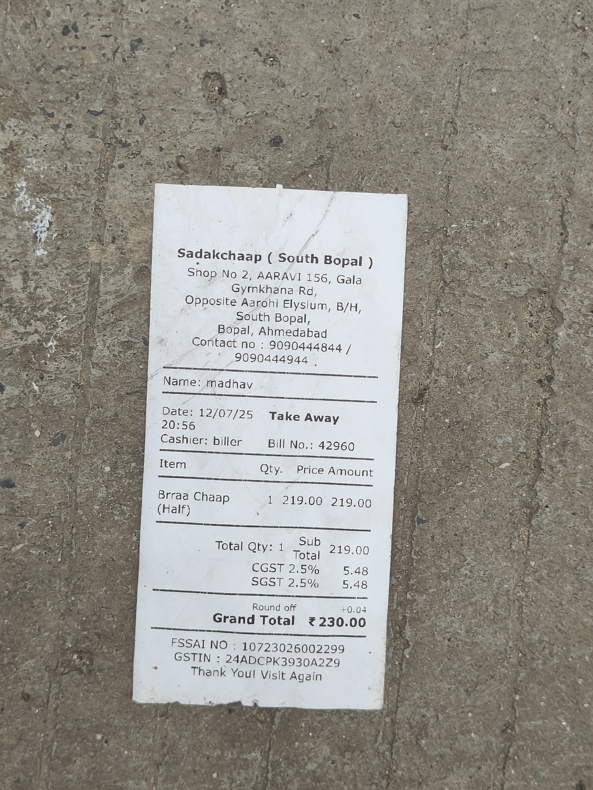
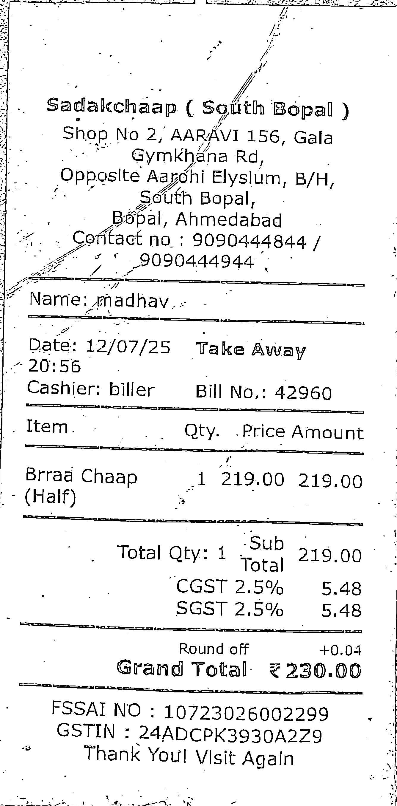

# Bill Scanner and Parser

The Bill Scanner and Parser processes raw or low-quality bill images using OpenCV techniques for preprocessing. After cleaning and enhancing the images, text is extracted through OCR and refined into structured, machine-readable data for seamless analysis.

---

## Demo

### Input Image


### Output Image


### Output JSON
```json
{
  "restaurant_name": "Sadalchaap (South Bopal)",
  "gst_number": "24ADCPK39304229",
  "date": "2025-07-12",
  "items": [
    {
      "name": "Brraa (Half)",
      "quantity": 1,
      "rate": 219.0
    }
  ],
  "tax_amount": {
    "CGST_2.5%": 5.48,
    "SGST_2.5%": 5.48
  },
  "total_amount": 230.0
}
```
## Future Scope

While the scanner works as a standalone project, its true potential lies in being integrated with larger applications.

**Possible directions include:**

- **Bill Splitting Apps** – Automatically extract structured data from bills to simplify group expense sharing.
- **Expense Tracking Tools** – Feed scanned bills directly into personal finance or budgeting software.
